# SourceTree使用教程

## 拉取项目
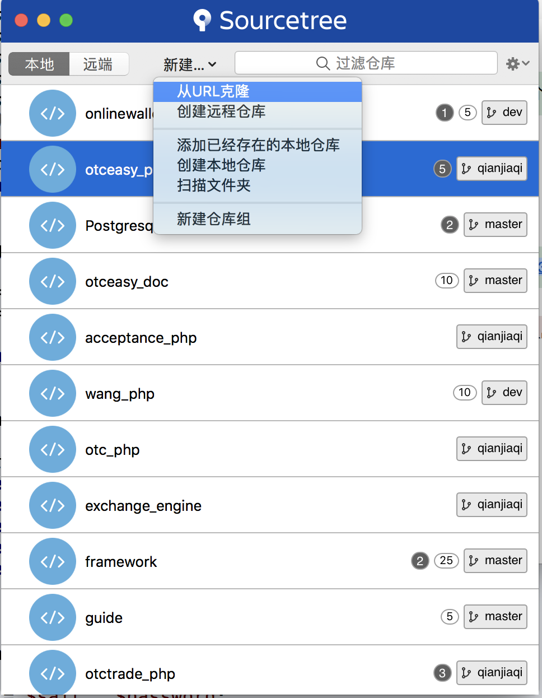
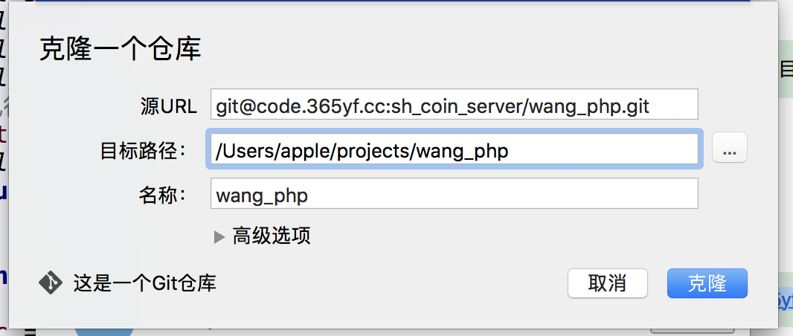
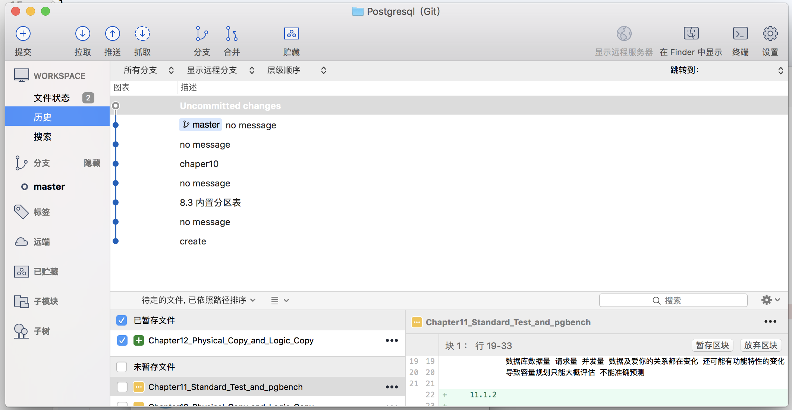
## 建立本地分支
- 项目拉取完,本地只有master
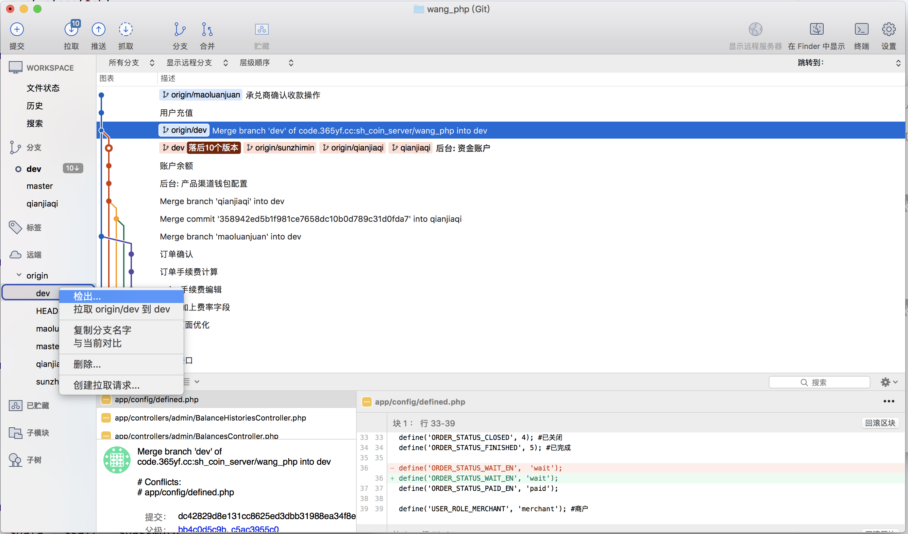
- 打开远端 找到Dev 检出
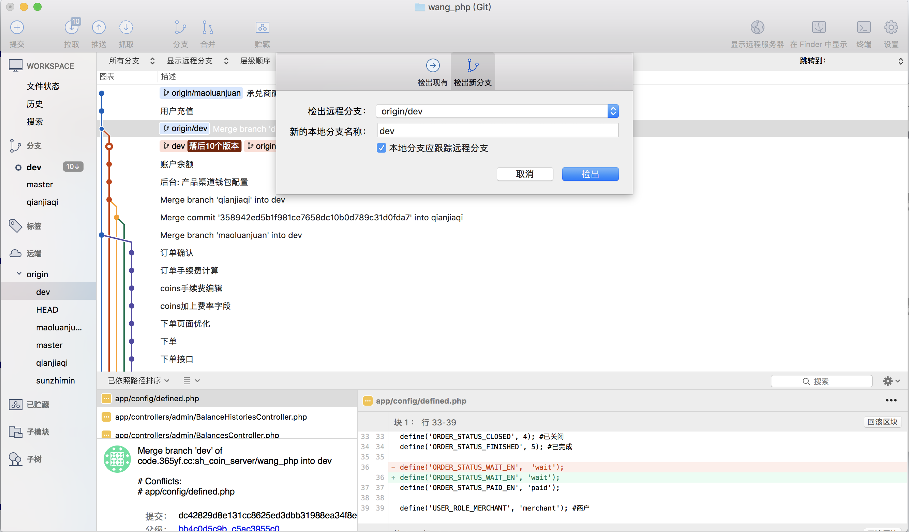
- 检出后 本地有Dev分支 继续操作建立自己的本地分支:
打开远端 找到Dev 检出 新的本地分支名称改为自己名字 选择检出
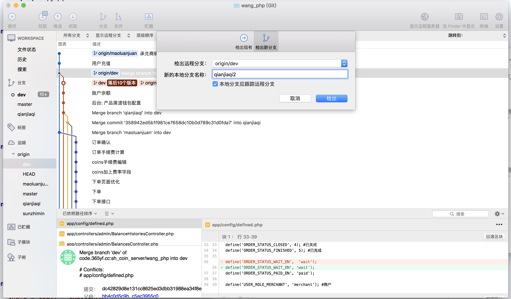

## 建立远端分支
- 左侧菜单栏 文件状态 勾选要提交的文件 提交 (提交到远端的自己的分支)

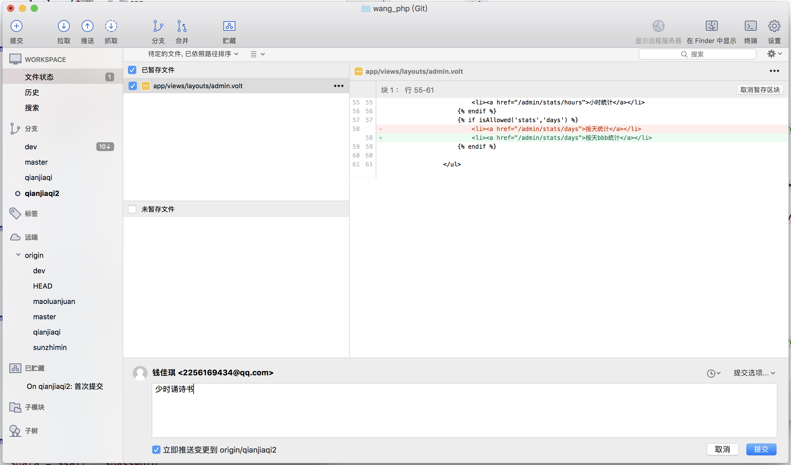
## 贮藏
- 左侧菜单栏 文件状态 选择贮藏
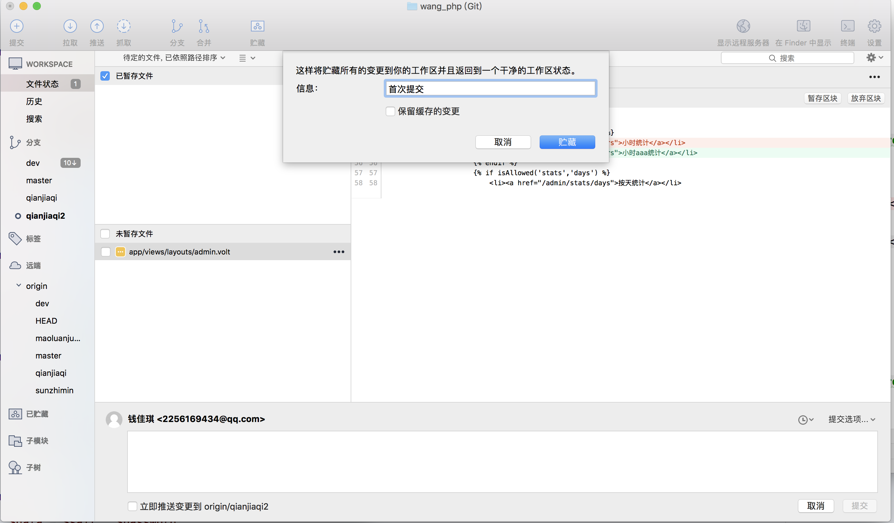
- 可以在已贮藏看到暂存文件
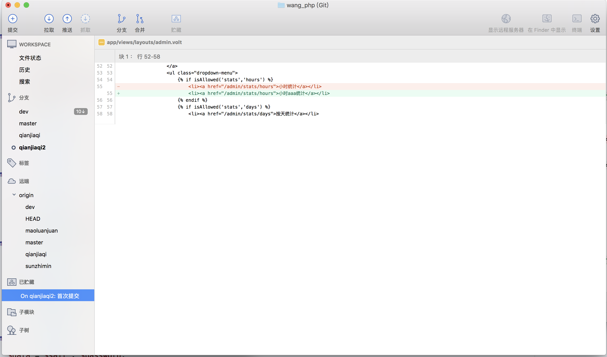

## 合并冲突
- 当文件报合并冲突时 打开项目代码 检查>>>> 和 ==== 分割符内的代码
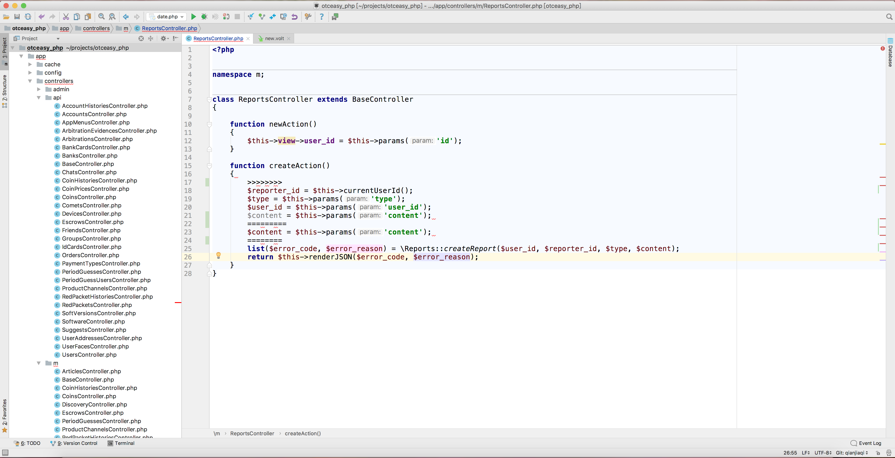
- 删除分割符号
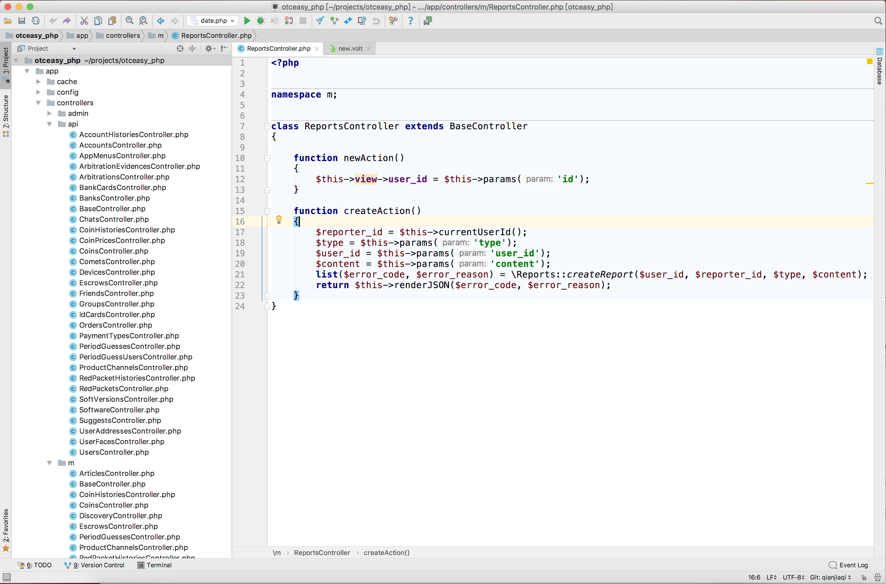
- 提交所有代码(此时写入提交信息 会自动显示合并冲突详情 直接提交即可)
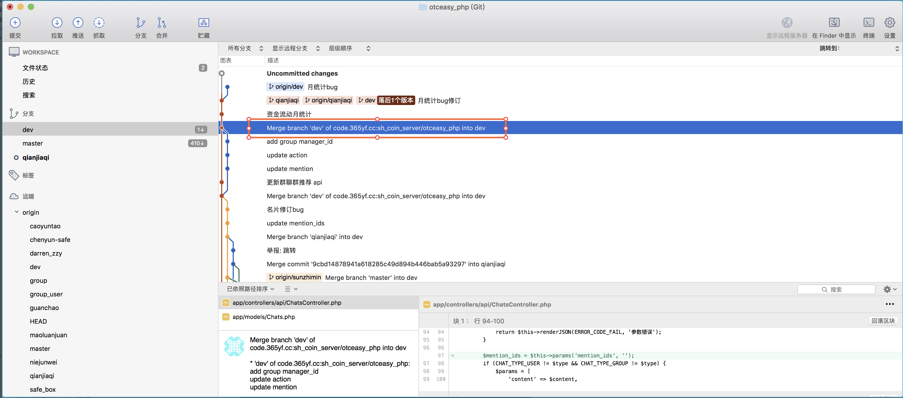
- 会出现这样的合并结果

## 拉取代码
- 选择Dev分支 左上角拉取
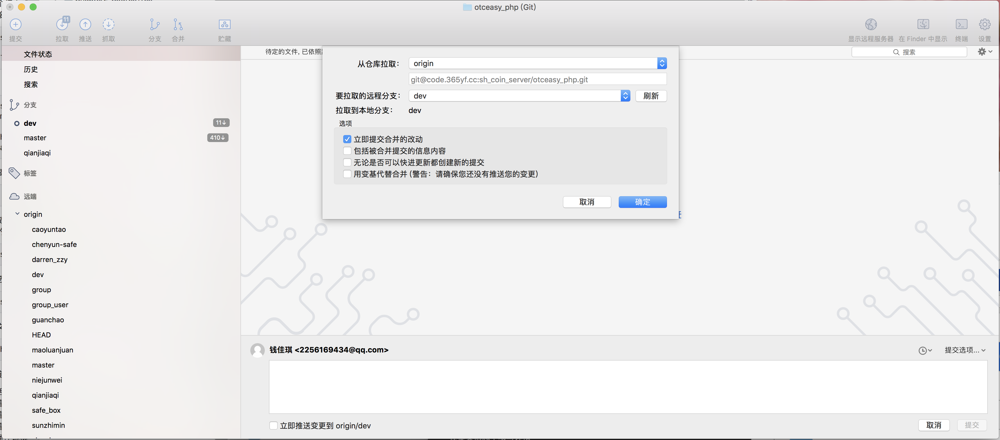
- 选择本地自己分支 上面选合并 选择要合并的版本 确定 推送
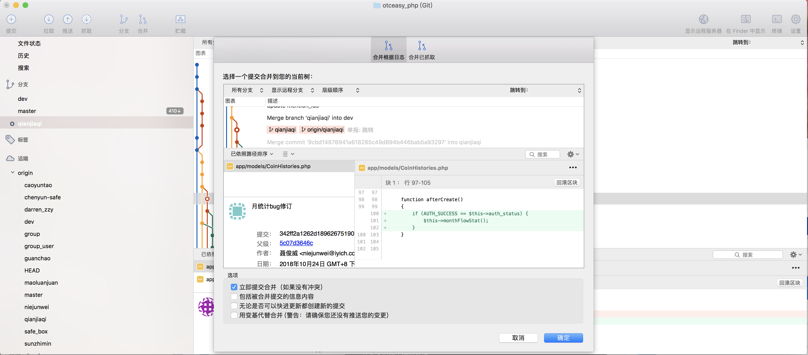
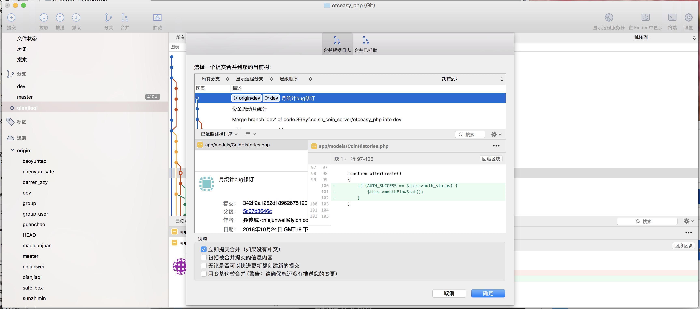
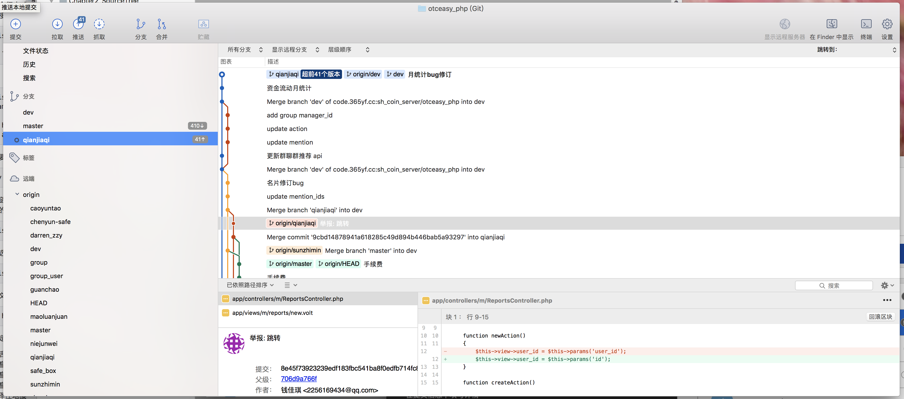