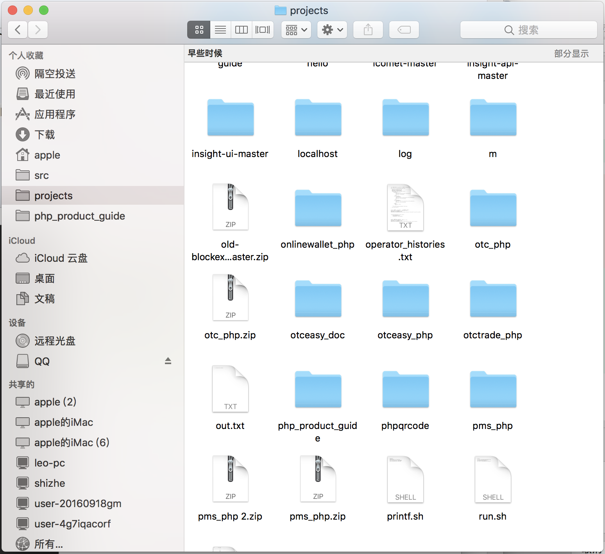
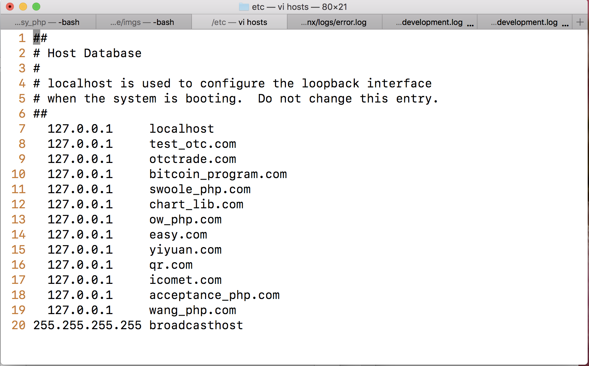
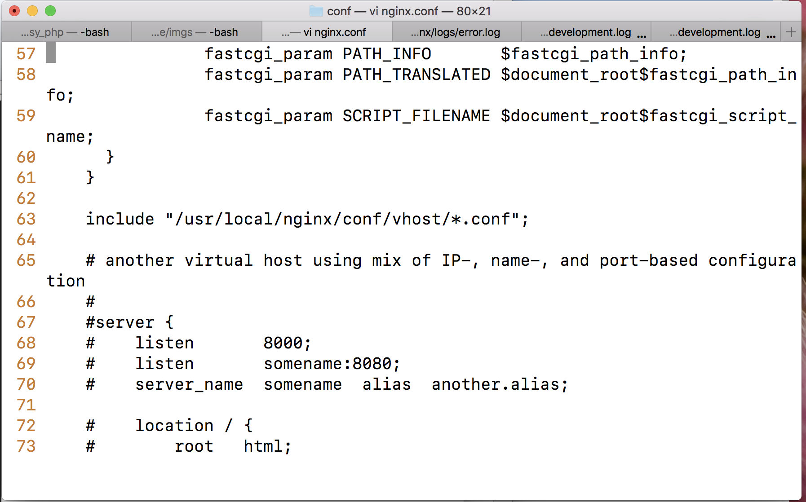
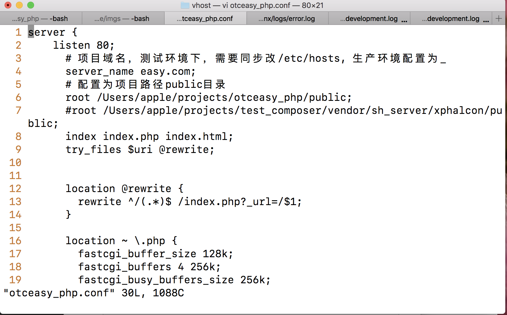
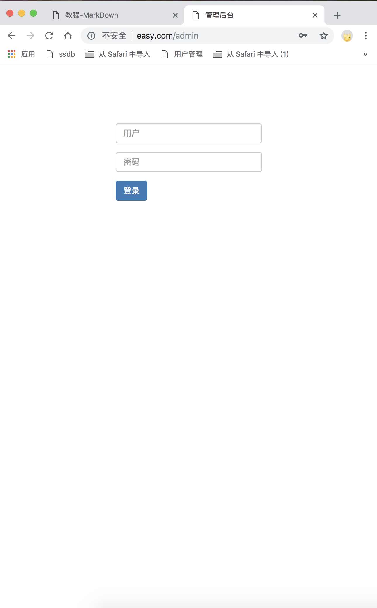

# 建立项目
## 项目地址:
	~/projects/otceasy_php

## 启动数据库
	pg_ctl start
	
## 建表建库拉框架:
	cd ~/projects/otceasy_php
	composer update
	php cli.php env init
	php cli.php db create
	php cli.php db migrate
	php cli.php env start

## 修改访问路径路由
- 修改/etc/hosts
- 
		cd /etc
		sudo vim hosts
		127.0.0.1 easy.com

- 配置Nginx路径
		
		cd /usr/local/nginx/conf;
		vi nginx.conf;
		include "/usr/local/nginx/conf/vhost/*.conf";

- 复制配置文件到新建的vhost

		cp ./nginx.conf /usr/local/nginx/conf/vhost/otceasy.conf
		cd vhosts
		vim otceasy.conf

## 重启Nginx
	sudo nginx -s reload
	
## 打开项目
	easy.com/admin
	
