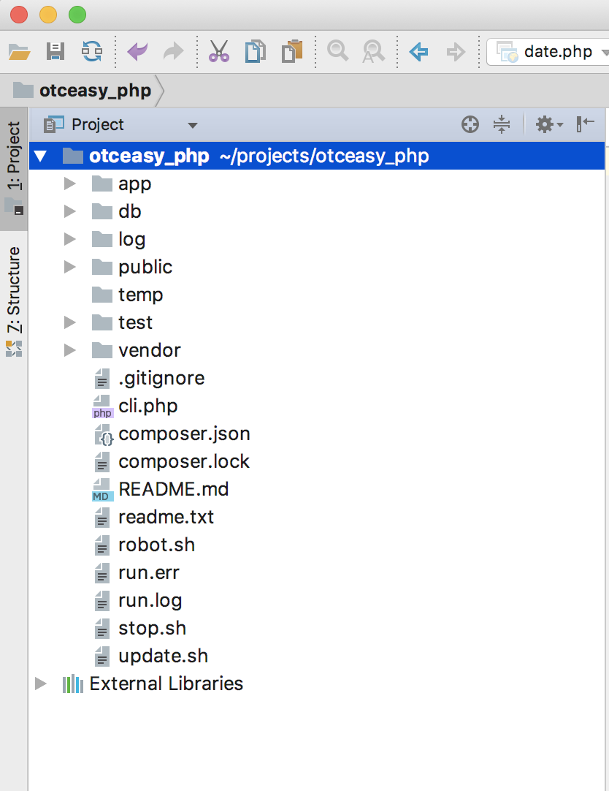

## 需要了解的快捷键:
### 查文件夹或文件: 按两下shift 从项目根目录开始全局搜索查找BaseModel
### 全局搜索代码: command+shift+f
### 代码格式美化: command+option+L
### 查找: command+f
### 替换: command+r
### 查找调用出处: command+点击要跳转的方法名/class名

## 须知: 
### 基本的项目写法在xphalcon框架里有样例
### BaseController Application BaseModel 这3个是重点
### BaseModel是重中之重
### 框架图很抽象 建议直接从Chapter5开始练手 再回过头来了解以下内容

## 项目的基本框架图

## 框架解读:
- app:
基础的项目代码
    - config 配置文件
        - acl.php: 后台各个管理员角色权限配置
        - config.php: ssdb redis 云端 3方接口等连接名定义
        - defined.php: 项目中用到的常量定义
        - utils.php: 通用方法
        
    - controllers (大驼峰命名方式)
        - admin: 后台项目的controller
            - HomeController.php 用户名 密码 
            (此处代码定义了首次输入的用户名密码是超级管理员的默认key)
            - DashboardController.php 登录成功
            - BaseController 基础的继承Controller
    - models
        - 直接对应数据库的表名字
    - views
        - admin
            - dashboard
                - index.volt 对应controller及model的html文件
    
    - tasks
        - 小驼峰式起名方式的任务 如userAddTask.php
            
            - 里面的方法是小驼峰Action 如 writeNameAction(){echo 'a';info('b');debug('c')}
                1. 终端~/projects/otceasy_php/执行: php cli.php userAdd writeName
                2. 可以在终端直接a
                3. 可以在tail -f log/development.log 直接看到b,c
        
        
- db:
数据库连接文件
    - migrate   迁移文件 在终端执行命令生成:
        php cli.php db generate {{sql语句}}
    - redis
        redis.conf配置文件
    - ssdb
        ssdb.conf配置文件 日志
               
- log:
日志
    - async.log 异步日志: 执行命令查看:tail -f log ~/projects/otceasy_php/logs/async.log 用于查看异步执行情况
    - development.log 代码中debug() info()打印的内容 用与断点调试
    - 自定义的其他日志 通过执行task任务记录
    php cli.php {{task任务名}} {{task任务方法}} >>log/{{自己起名}}.log
    
- public
    - 公共的js css imgs
    - index.php 项目入口文件
    - js
        - admin.js 所有.volt文件通用的html标签 js方法
        - echart.js 图表插件
        - jquery
    
- vendor
    - sh_server
        - xphalcon 所有namespace为phalcon的 都是这个文件夹
            - app
                - config
                    - acl.php  管理员权限模板
                    - config.php  配置连接的模板
                    - config.php  配置连接的模板
                    - defined.php  常量定义的模板
                    - router.php 路由分配
                - models
                    - BaseModel.php BaseModel是所有的model类继承的类 里面含有快照 查找sql 异步的调用逻辑 都是精品
                - tasks
                    - async.task 启动异步

            - public
                - js
                    - admin.js 所有.volt文件通用的html标签 js方法
    
    