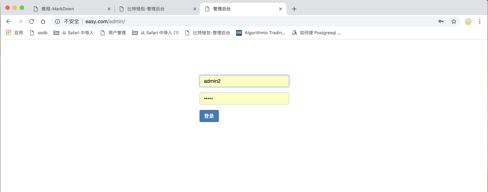
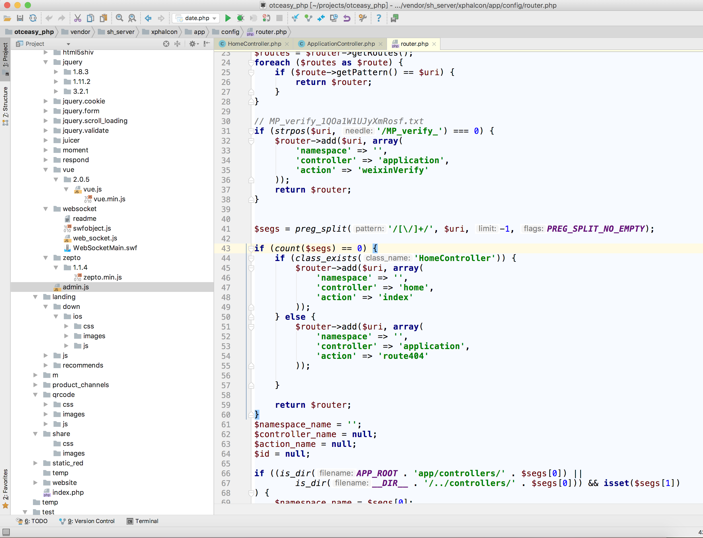
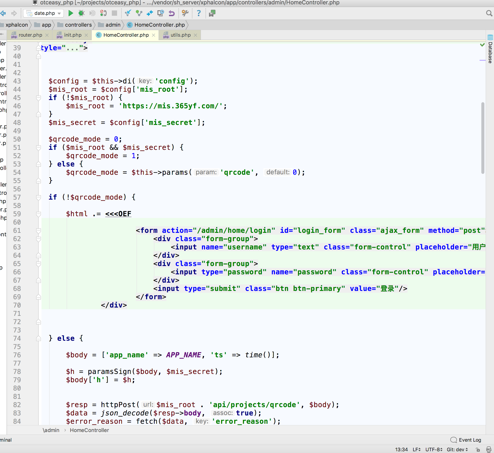
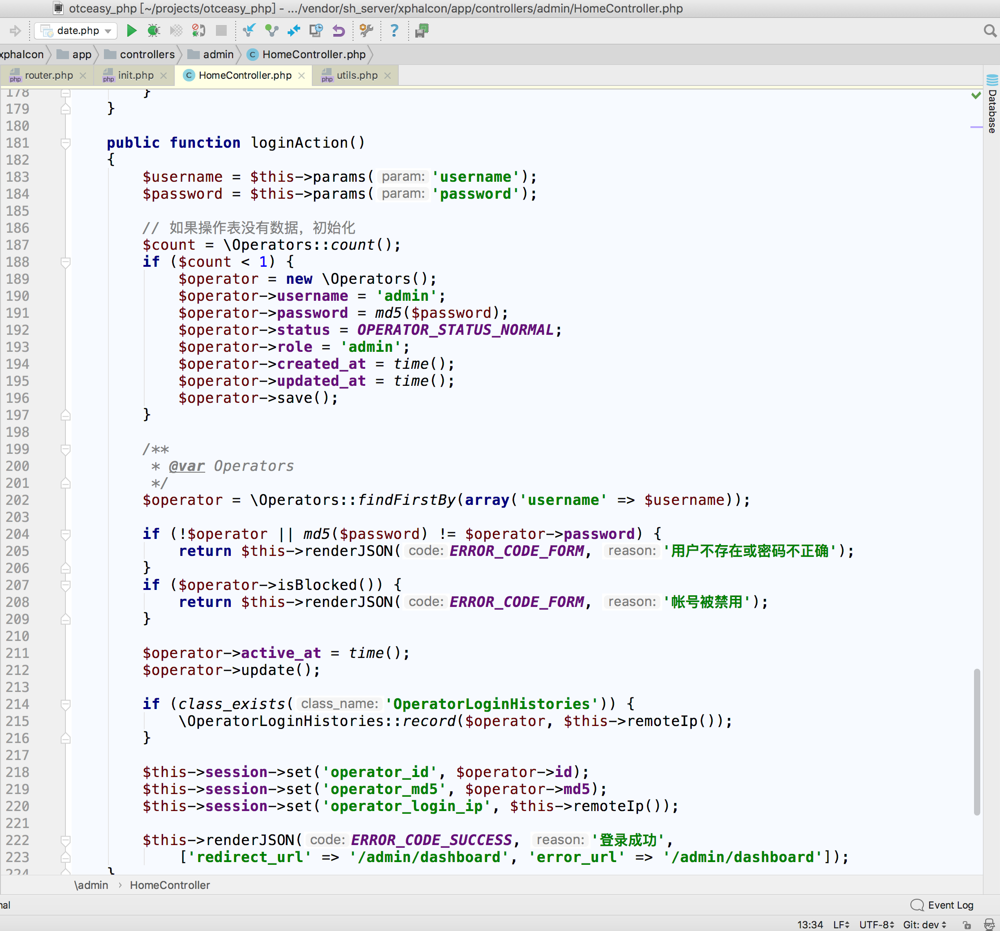
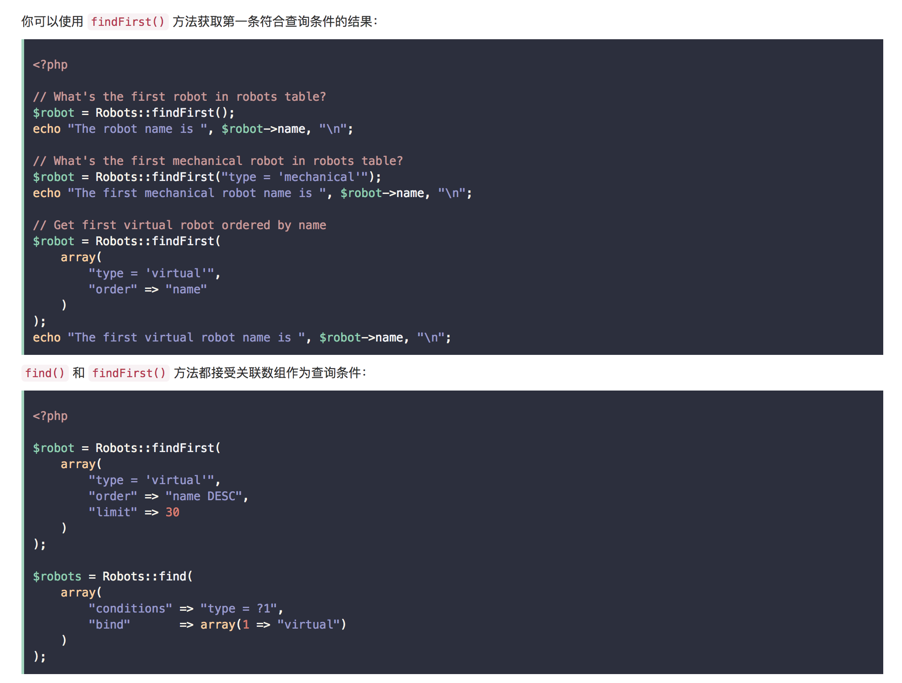
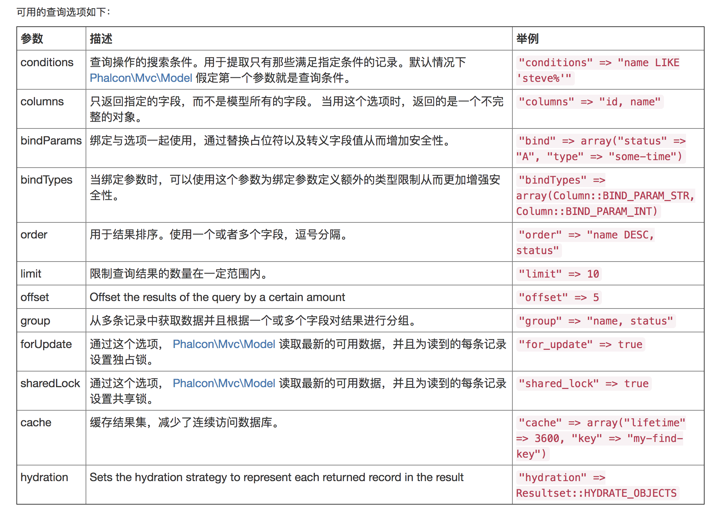

# 查询

## 访问项目

访问easy.com/admin

首次进入该页面 读取的controller是/app/controllers/homeController

这是由router.php决定的:(双击shift即可跳转router.php)

## 表单
html是在HomeController加载的

## 代码解析
form中提交的位置是/admin/home/login 也就是homeController/loginAction()

    $username = $this->params('username');
    $password = $this->params('password');
    
###接收参数
$this是当前homeClass实例化 params()是application.php的方法
command+点击params可以跳转到这个方法内部查看

    $count = \Operators::count();
    
###\Operators:既是表操作 也是model方法操作
\Operators 是指model/Operators.php    
在phalcon框架中 通过model类进行表的数据库操作   
count()是数Operators表中的记录数

### 首次登陆默认账户名密码

    if ($count < 1) {
        $operator = new \Operators();
        $operator->username = 'admin';
        $operator->password = md5($password);
        $operator->status = OPERATOR_STATUS_NORMAL;
        $operator->role = 'admin';
        $operator->created_at = time();
        $operator->updated_at = time();
        $operator->save();
    }

如果\Operators表没有记录 就存账户名为admin 角色为超管 状态可用 
密码是当前输入的密码md(5)加密后的值

### 查找用户 验证密码

    $operator = \Operators::findFirstBy(array('username' => $username));

这是通过username这个表字段查询第一个符合条件的对象 将对象赋予$operator
findFirstBy()是Phalcon框架的对象查找方法

[Phalcon 官网](http://example.com/ "Title")

另外, 在BaseModel中可以看到这个方法的各种应用:

    findFirstById() 通过ID查找第1个符合的对象
    findFirstByIds() 通过ID的数组或字符串查找一系列对象
    findCacheByIds() 通过缓存查找
    findPagination() 分页查找
    findForeach()   遍历

### 对象调用

    if (!$operator || md5($password) != $operator->password) {
        return $this->renderJSON(ERROR_CODE_FORM, '用户不存在或密码不正确');
    }
通过$operaotr->password获取数据库中的password字段值
renderJson是封装好的返回格式 需要的参数分别是 错误代码(常量)\提示信息(字符串)\重定向URL(数组)

### 方法调用
    if ($operator->isBlocked()) {
        return $this->renderJSON(ERROR_CODE_FORM, '帐号被禁用');
    }
    
isBlocked() 是\Operators类中的function 可以通过\Operators实例化出的$operator直接调用

### 静态方法调用
    if (class_exists('OperatorLoginHistories')) {
        \OperatorLoginHistories::record($operator, $this->remoteIp());
    }   
静态方法可以直接\ModelName::functionName()

### 存session并跳转
    $this->session->set('operator_id', $operator->id);
    $this->session->set('operator_md5', $operator->md5);
    $this->session->set('operator_login_ip', $this->remoteIp());
    
    $this->renderJSON(ERROR_CODE_SUCCESS, '登录成功',
        ['redirect_url' => '/admin/dashboard', 'error_url' => '/admin/dashboard']);

    