# 新建项目

## 新建表
##### 到终端里执行建表命令:
##### 项目规则: 表名都要是复数
    
    php cli.php db generate {{建表语句}}
    php cli.php db generate create_table_users
    
在/db/migrate/下可以看到新建的空文件 文件中输入建表语句
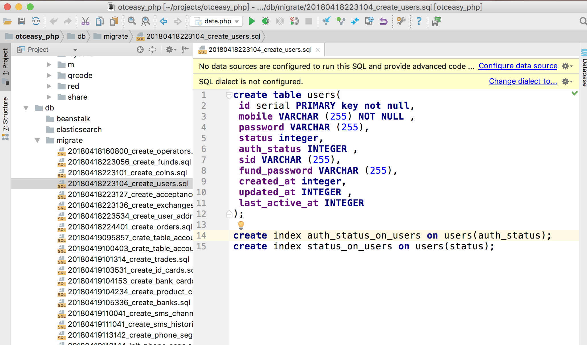

终端执行migrate

    php cli.php db migrate
    
这时刷新数据库连接可以看到新表
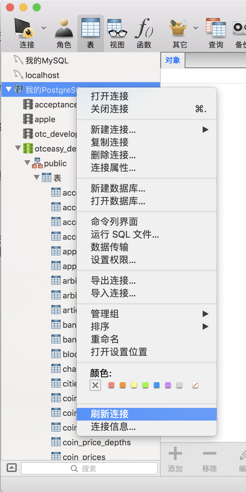 
    
##### 相应的 所有的数据库修改都是这样执行命令 比如修改表

    php cli.php db generate alter_table_users_add_column_real_name
    
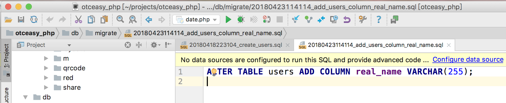

## 新建controller model views

### 书写格式
项目的mvc引用的大小驼峰和单复数书写格式是:

    路由: easy.com/admin/users
    /controllers: /admin/UsersController.php
    /models: Users.php
    /views: /admin/users/index.volt
    表名: users
    
如果是2个单词:

    路由: easy.com/admin/user_histories
    /controllers: /admin/UserHistoriesController
    /models: UserHistories.php
    /views: /admin/user_histories/index.volt
    表名: user_histories
    
### e.g.
以acceptances表为例 可以看到它对应的MVC的位置和命名如下图所示:

##### Controller
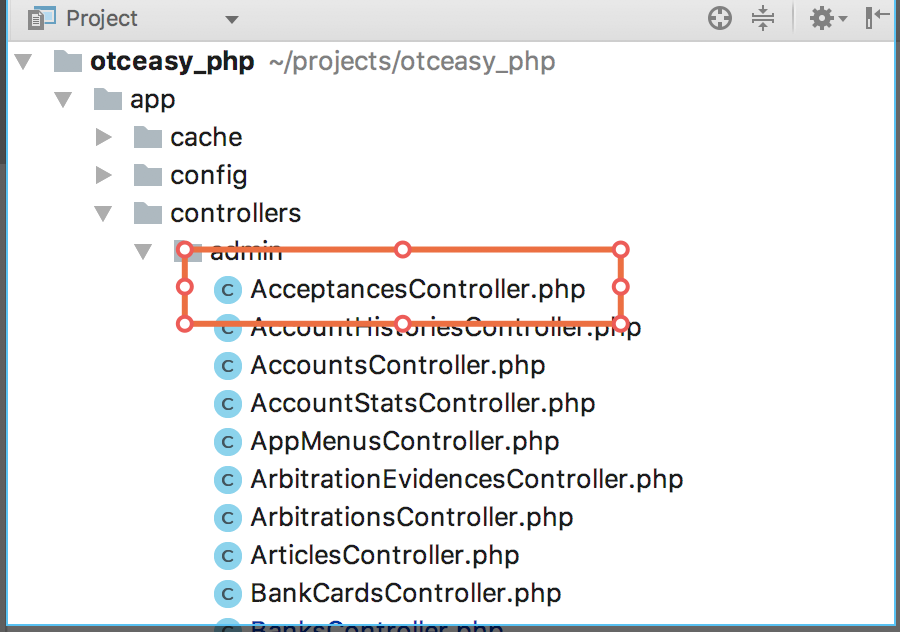
##### Model
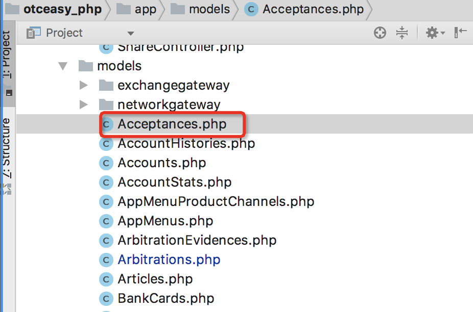
##### View
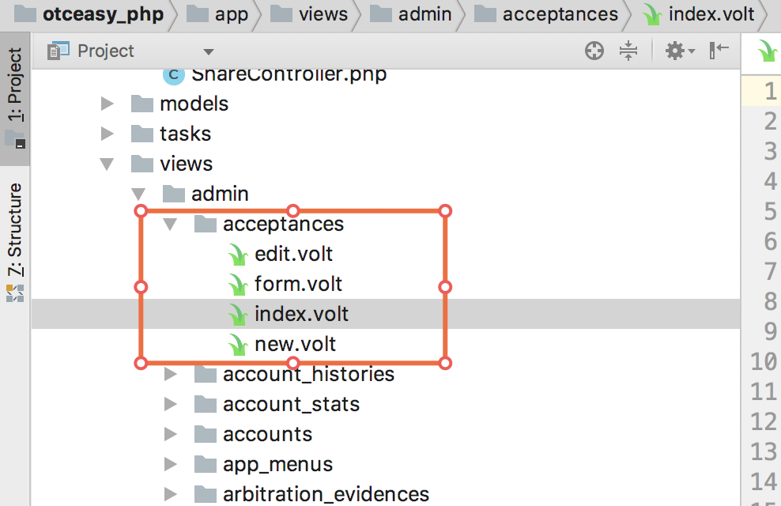

##Controller写法

    namespace admin;
    
    class UsersController extends BaseController{
        indexAction(){
        
        }
    }
    
命名空间是所在的文件夹名字;

所有controller都继承BaseController BaseController里面写的是默认的验证规则等

所有的方法名都以Action结尾 方法名都是小驼峰写法:

    namespace admin;
        
    class UsersController extends BaseController{
        createUserAction(){
        
        }
    }
    
### 分页查找
    $cond = $this->getConditions({model_name});
    
    $cond = $this->getConditions('user');
    $cond = $this->getConditions('acceptance');
    
getConditions在applicationController中

这个model_name的字符串是和view中表单查找所提交的参数是样的:

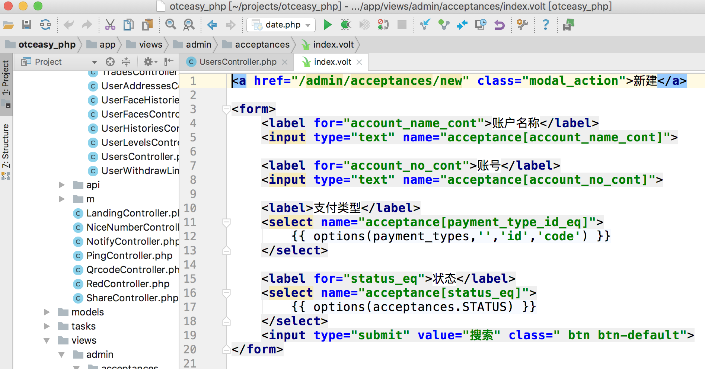

如图 表单的搜索框 其中input标签的name的格式就是
    
    {model名}[{字段名}_{搜索模式}]
    user[real_name_eq]
    acceptance[account_name_cont]
    
搜索模式在applicationController中的getConditions()方法中

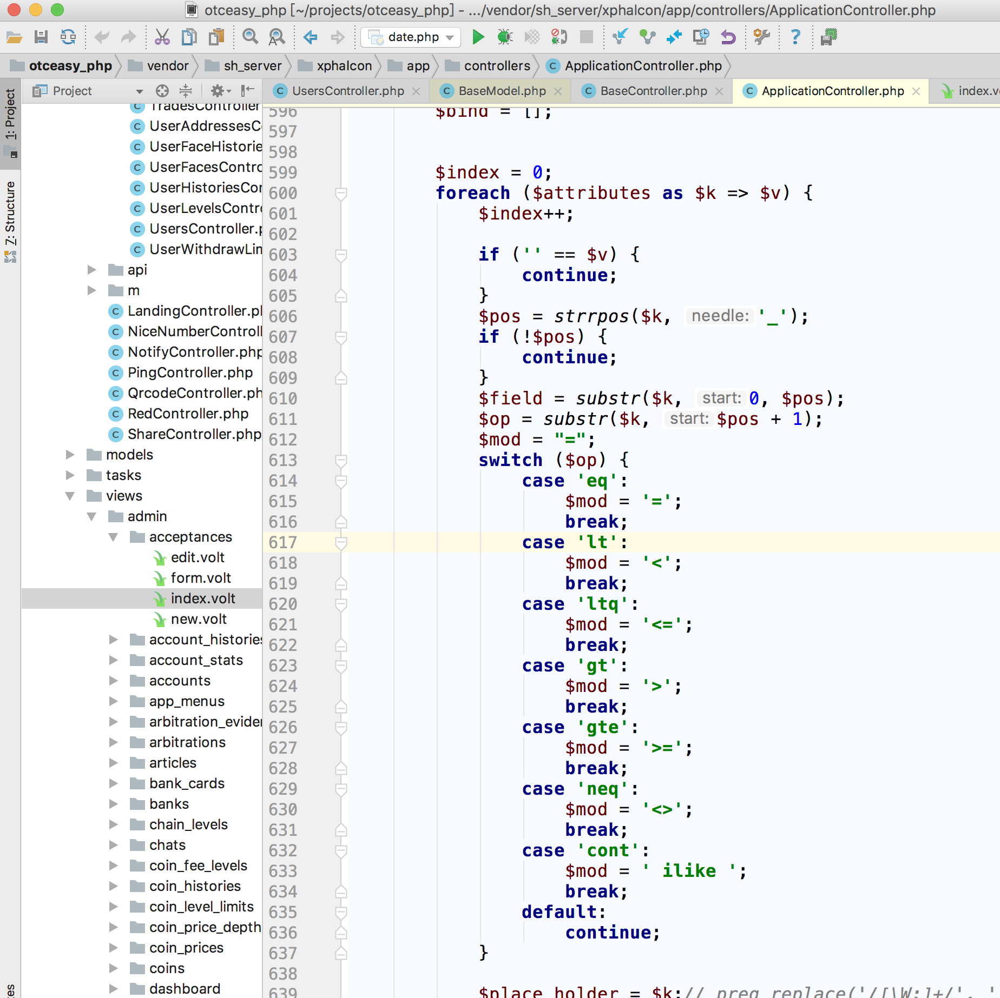

    $users = \Users::findPagination($cond, $page); 
    
findPagination()是分页查找

### 输出到视图

    $this->view->users = $users;
    
这是phalcon模板引擎的应用方式:
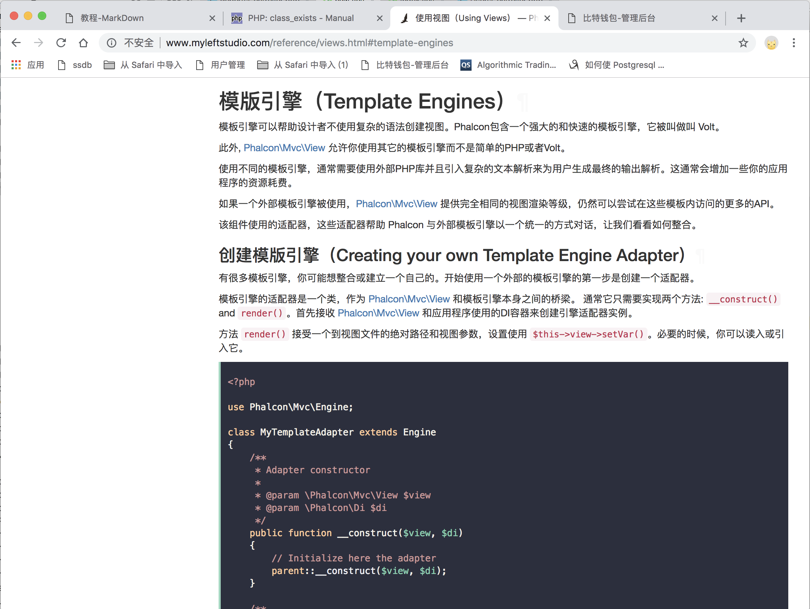

将分页查找后的对象赋予view 中的 users对象
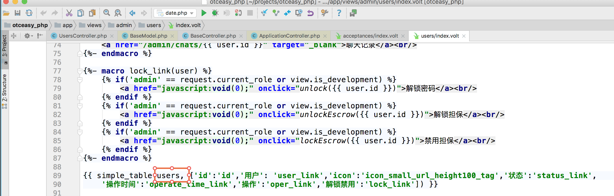

Model写法 

    class Users extends BaseModel(){
    }
   
   
   
    
### 常量定义

    static ${字段名} = [常量1 => '注释1', 常量2 => '注释2'];
    static $STATUS = [USER_STATUS_ON => '正常', USER_STATUS_BLOCKED_ACCOUNT => '账户冻结',
            USER_STATUS_BLOCKED_DEVICE => '设备冻结'];
            
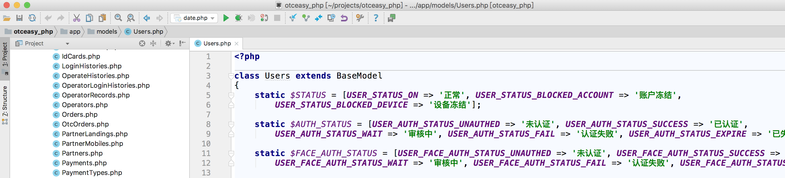
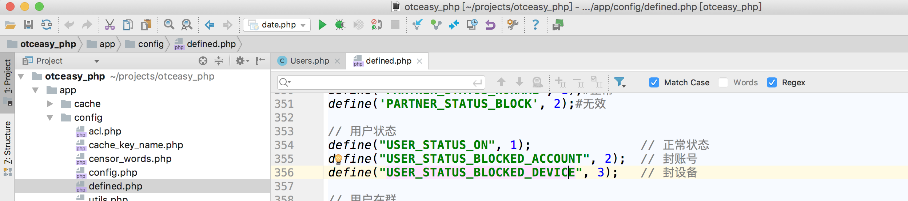

在模板中使用常量的注释:
    
    {字段名_txt}

            
应用原则:
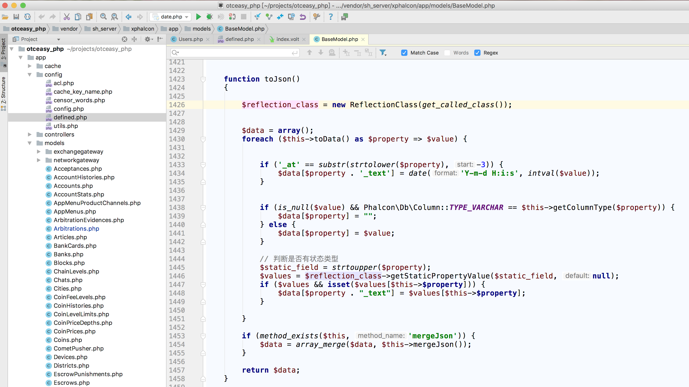
将字段转为大写 看是否有定义同名的静态变量 如果有 就根据常量定义 将字段值转为注释的文字
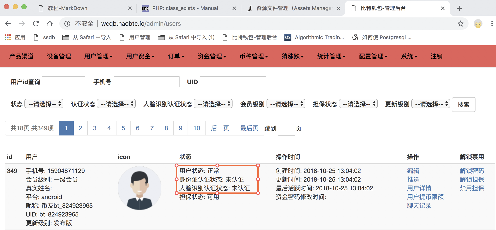

这里显示的都是文字

同理 时间也可以写为created_at_text 转为Y-m-d H:i:s时间

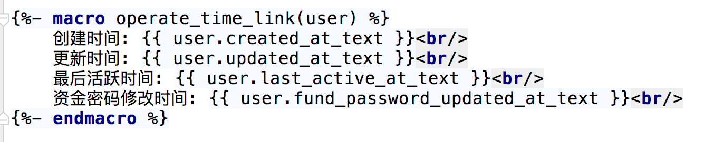
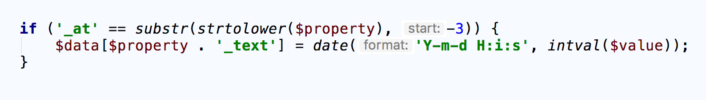

#### 连表查询
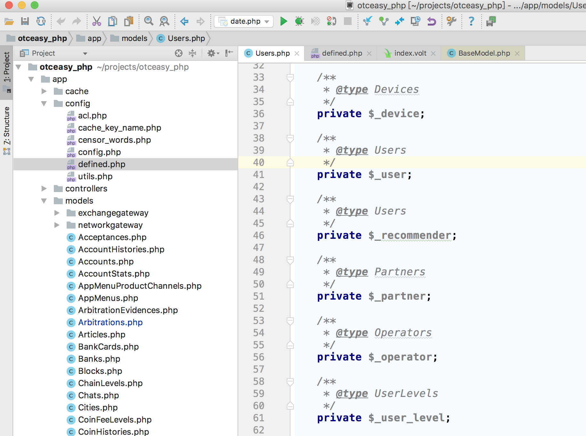

    /**
     * @type {表名}
     */
    private $_连接的字段名;
    
    /**
     * @type Users
     */
    private $_user;
    
    /**
     * @type Users
     */
    private $_recommender;

案例: 在用户推荐表UserRecommends表里

我又要展现用户本人的ID和姓名 还要展现用户的推荐人的ID和姓名

第一步 在UserRecommends表里存2个字段: user_id recommender_id
分别表示: 用户user是由用户recommender推荐的

第一步 在UserRecommends 定义

    /**
     * @type Users
     */
    private $_user;
    
这样就将所有user_开头的字段都关联Users表
    
这样 我就能在views/user_recommends/index.volt 展示用户名

    {{ simple_table(user_recommends, ['id':'id','用户ID': 'user_id','用户名':'user_name']) }}
    
第二步 在UserRecommends 定义

    /**
     * @type Users
     */
    private $_recommender;
    
这样就将所有recommender_开头的字段都关联Users表
    
这样 我就能在views/user_recommends/index.volt 展示用户名

    {{ simple_table(user_recommends, ['id':'id','用户ID': 'user_id','用户名':'user_name','推荐人ID': 'recommender_id','推荐人姓名':'recommender_name']) }}
    
### 虚拟字段

    /**
     * 是否已经登出
     * @type boolean
     */
    private $_is_logout = 0;
    
这个字段是存在缓存中的 使用原则在BaseModel中

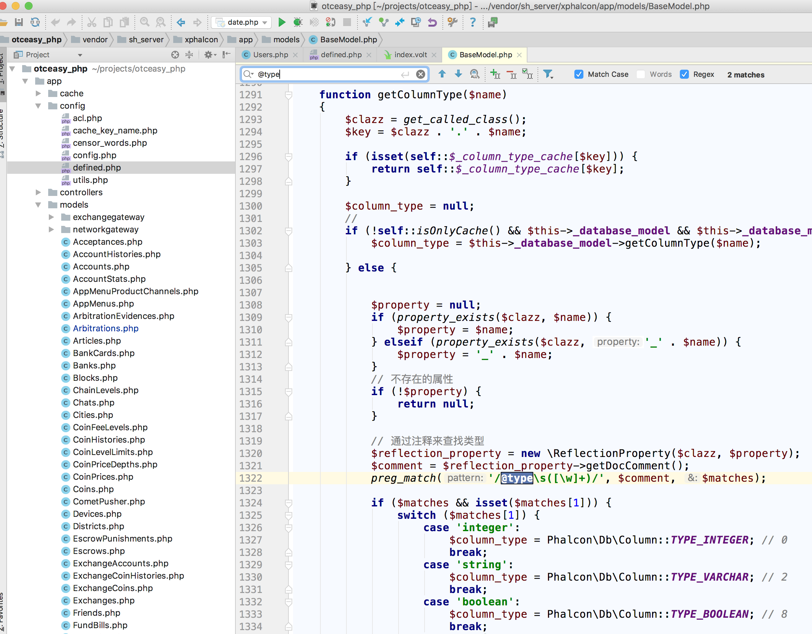 
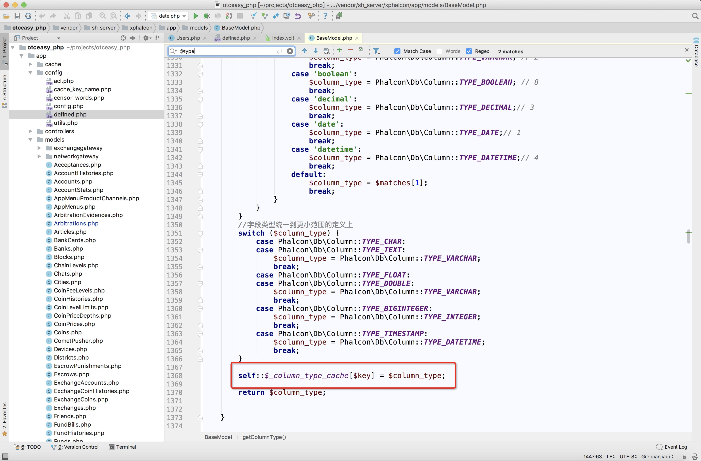 

### 保存缓存

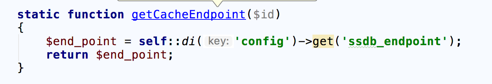 

更高效得读取数据 如果我们直接在数据库里改数据 如果页面上没有及时反馈 可能是因为缓存

### beforeCreate afterCreate beforeUpdate afterUpdate

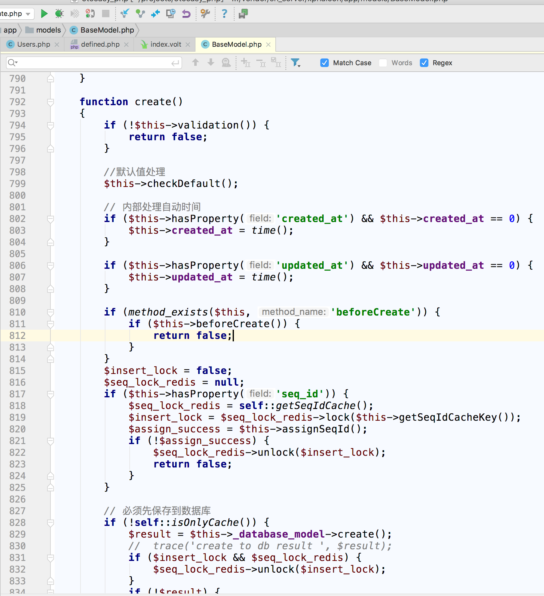 

BaseModel里的重要方法 在save()或update()方法前后执行

注意 在812行 如果接收到true 就会return false;

也就是说 如果想阻止程序运行 就要return true;

    class Users extends BaseModel(){
    
    function beforeCreate(){
    // 假如要求用户名不能重复
    // 根据当前要创建的用户名查表 如果能找到记录 就不允许创建用户
        $user = \Users::findFirstByName($this->name);
        if($user){
        // 这里return true反而是表示阻止程序运行
            return true;
        }
    }
    
    function create(){
        $this->save();
    }
    
    }

### asyncBeforeCreate asyncAfterCreate asyncBeforeUpdate asyncAfterUpdate
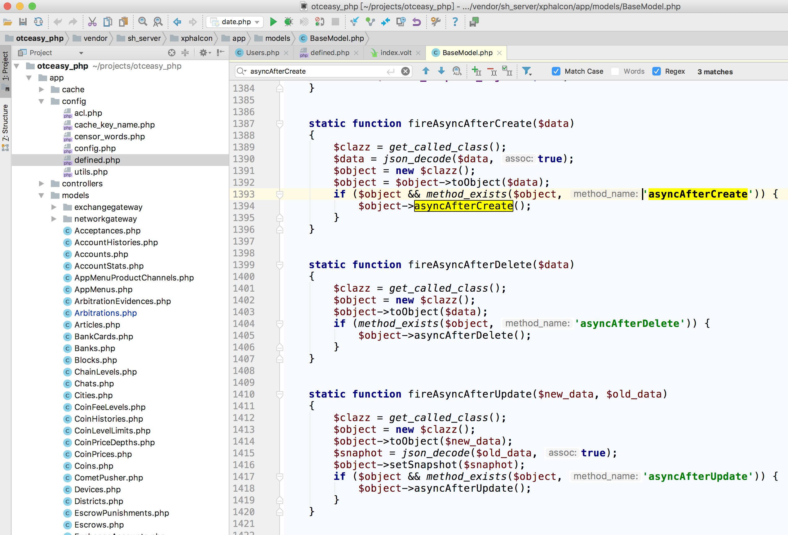 

异步执行在update() 或 save()前后

需要重启异步

    重启异步:
    php cli.php async stop
    php cli.php async start
    
### 返回特定的值

假如接口中要求用特别的格式返回一个值 比如0.0000000001

    {{ simple_table(users, ['用户资金':'money']) }}
    
这时会展现科学技术法的E-10

如果要正常显示数字 需要numberFormat处理 这时可以在model里写方法:

    function moneyFormat(){
        return numberFormat($this->money,10);
    }
    
就会展现0.000000001
    
然后view写:

    {{ simple_table(users, ['用户资金':'money_format']) }}
    
- 比如要换算其他格式:

    function moneyChineseName(){
        return $this->money*10.'元';
    }
    
然后view写:

    {{ simple_table(users, ['用户资金':'money_chinese_name']) }}
    
就会展现1元

### redis ssdb 应用

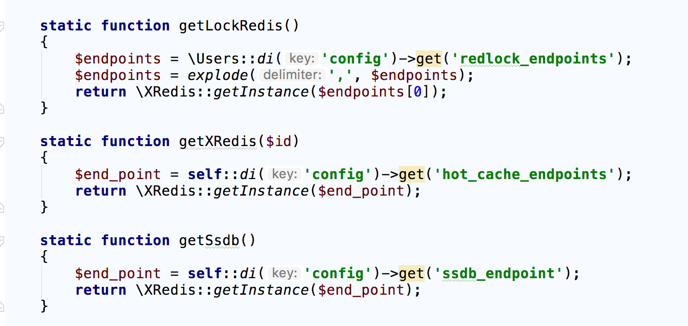
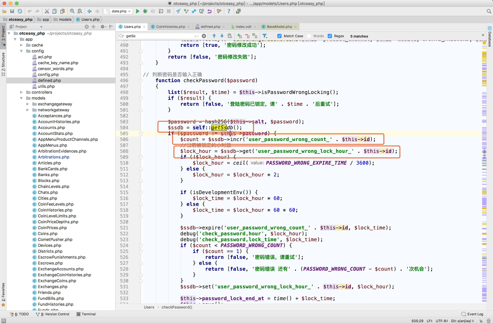

可用的ssdb/redis方法可以参考XRedis类

调起配置项: 

    static function getSsdb()
    {
        $end_point = self::di('config')->get('ssdb_endpoint');
        return \XRedis::getInstance($end_point);
    }
    
获取ssdb/redis对象:
    
    $ssdb = self::getSsdb();
    
执行:
    
    $ssdb->incr('user_password_wrong_count_' . $this->id);
    
## VIEW写法

#### 查询表单
    <form>
    
        <label for="id_eq">用户id查询</label>
        <input type="text" name="user[id_eq]" id="id_eq" style="width: 100px" value="{{ user_id }}">
    
        <label for="escrow_status_eq">更新级别</label>
        <select name="user[release_level_eq]" id="release_level_eq">
            {{ options(Users.RELEASE_LEVEL) }}
        </select>
    
        <button type="submit" class=" btn btn-default">搜索</button>
    </form>
    
这是一个查询表单 注意input 和 select 标签里name的写法

#### 相当于td标签的macro标签 模板引擎的方法
    
        {要引入的内容}
    
    
比如说:

    
        手机号: {{ user.mobile }} 
        会员级别: {{ user.user_level_name }} 
        真实姓名: {{ user.real_name }} 
        平台: {{ user.platform }} 
        昵称: {{ user.nickname }} 
        UID: {{ user.uid }} 
        更新级别: {{ user.release_level_text }}
    
 
里面的_text写法已经在上文讲过 是为了自定义展示常量   
   
#### 表格展示 模板引擎自带

    {{ simple_table(users, ['id':'id','用户': 'user_link','icon':'icon_small_url_height100_tag','状态':'status_link',
    '操作时间':'operate_time_link','操作':'oper_link','解锁禁用':'lock_link']) }}

#### 变量引入

在controller里写$this->view->变量名 = 值;可以带到页面

    // 获取当前的Operator
    $now_operator = $this->currentOperator();
    
    $this->view->current_role = $now_operator->role;
    
View展示:

    
        
            <a href="javascript:void(0);" onclick="unlock({{ user.id }})">解锁密码</a> 
        
    
    
 对于onclick事件 ajax请求 请自行学习
 
 这里放一个jquery的代码 可以百度一下尝试了解每一步的意思
 
     
     
这段代码可以直接放在.volt文件中 html会自动解析script标签 就像解析style标签一样